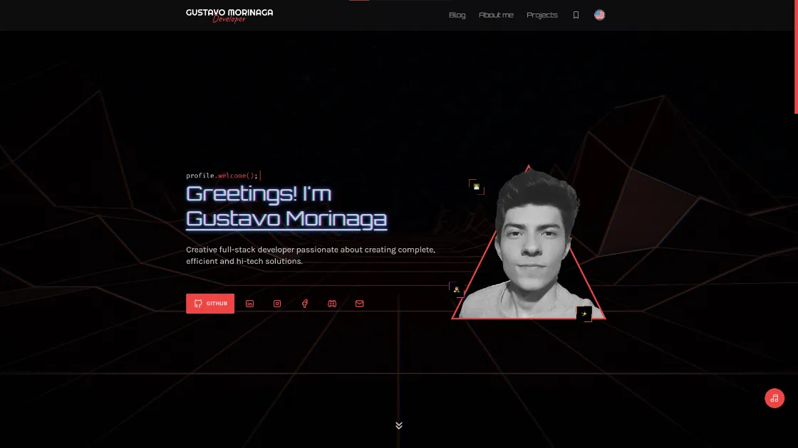

<!-- markdownlint-disable MD014 -->
<!-- markdownlint-disable MD026 -->
<!-- markdownlint-disable MD033 -->
<!-- markdownlint-disable MD041 -->

<h1 align="center">
  ▲ Portfolio - Gustavo Morinaga
</h1>

<!-- Banner Section -->

  

<h3 align="center">
  My super portfolio built with SvelteKit and served on Vercel.
   
  <a href="https://gustavomorinaga.dev">
    Click to visit the portfolio
  </a>
</h3>

---

<!-- Badges Section -->

  
  
  
  
  

---

<!-- Translations Section -->

## 🌎 Traduções

<kbd></kbd>
<kbd></kbd>

<!-- Introduction Section -->

## 📖 Introdução

Este repositório é dedicado para mostrar os meus projetos, marcadores, postagens do meu blog e informações sobre mim.

### Seções

- **Início** - Contém uma breve apresentação
- **Blog** - Onde todas as minhas postagens que escrevi para qualquer um poder ler
- **Sobre mim** - Informações mais detalhadas e curiosidades sobre mim
- **Projetos** - Uma vitrine de todos os meus projetos
- **Marcadores** - Todos os marcadores que gosto e recomendo usar

<!-- License Section -->

## 📜 Licença

Este site não foi criado para ser um modelo ou tema, mas para meu próprio uso. Sinta-se à vontade para pegar qualquer trecho de código ou inspiração que desejar, mas não foi escrito com a intenção de ser clonado e implantado. Obrigado!

Este projeto está licenciado sob a **Licença MIT** - veja a página [LICENSE](../../../LICENSE) para mais detalhes.

<!-- Acknowledgment Section -->

---

### ❤️ Thanks for your attention!
